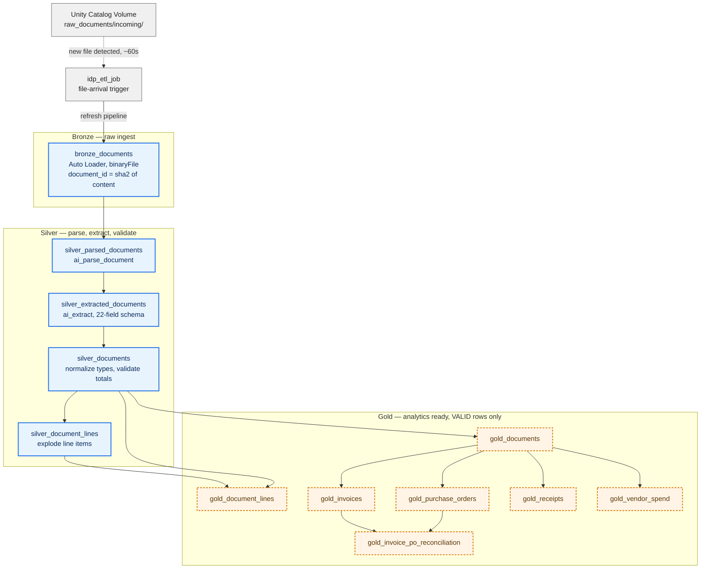

# databricks-idp-test

Intelligent Document Processing (IDP) on Databricks, packaged as a Declarative
Automation Bundle (DAB). Business documents — invoices, purchase orders and
receipts — land in a Unity Catalog volume as PDFs and are automatically parsed,
extracted, validated and reconciled into analytics-ready tables.

Everything is declarative: the pipeline is defined with the
`pyspark.pipelines` API (Lakeflow Declarative Pipelines), and the deployment is
defined in `databricks.yml`. There is nothing to click.

## How it works

A document dropped into the watched volume folder is processed end to end
without any manual step. A file-arrival trigger on `idp_etl_job` notices the new
file within about a minute and refreshes the pipeline.



Solid blue nodes are **streaming tables** (append-only, incremental). Dashed
amber nodes are **materialized views** (recomputed in full on each update). The
split is not configured anywhere — `@dp.table` infers it from whether the query
reads with `spark.readStream` or `spark.read`.

### What each stage does

| Stage | Purpose |
| --- | --- |
| `bronze_documents` | Ingests file bytes with Auto Loader. Filters to supported extensions and keys each document by a SHA-256 hash of its content. |
| `silver_parsed_documents` | `ai_parse_document` turns the binary blob into a structured VARIANT document representation. |
| `silver_extracted_documents` | `ai_extract` pulls 22 business fields plus nested line items, guided by `DOCUMENT_EXTRACTION_SCHEMA`. |
| `silver_documents` | Flattens the VARIANT, casts to typed columns, normalizes text and dates, then validates: recomputes the total and assigns a `validation_status`. |
| `silver_document_lines` | Explodes line items and validates each line's `quantity × unit_price` against its stated amount. |
| `gold_*` | Restricted to `validation_status = 'VALID'`, then split by document type and aggregated. Includes monthly vendor spend and invoice-to-PO reconciliation. |

Validation is the interesting part. `silver_documents` recomputes
`subtotal + tax + shipping − discount` and compares it against the document's
stated total, flagging `TOTAL_MISMATCH` when they disagree by more than a cent.
Because the gold layer filters on `VALID`, a document that fails validation is
excluded from every gold table rather than silently corrupting a total.

## Repository layout

```
databricks.yml                                # bundle definition, dev + prod targets
resources/
  idp_etl.pipeline.yml                        # the serverless declarative pipeline
  idp_etl.job.yml                             # the job carrying the file-arrival trigger
src/idp_etl/transformations/
  idp_pipeline.py                             # all 12 table definitions
sample_data/                                  # example documents to test with
```

## Environments

Both targets deploy to the same workspace and are separated by Unity Catalog
catalog. There is no workspace boundary between them.

| | dev | prod |
| --- | --- | --- |
| Catalog | `idp_test_dev` | `idp_test_prod` |
| Schema | `idp_test_project` | `idp_test_project` |
| Watched folder | `/Volumes/idp_test_dev/idp_test_project/raw_documents/incoming/` | `/Volumes/idp_test_prod/idp_test_project/raw_documents/incoming/` |
| Bundle mode | `development` (resources prefixed `[dev <user>]`) | `production` (pinned root path) |

Catalog, schema and source path are bundle variables, never hardcoded in the
pipeline source. The pipeline reads its input path from the `idp.source_path`
configuration value set per target.

## Getting started

Requires the [Databricks CLI](https://docs.databricks.com/dev-tools/cli/install.html)
and a Unity Catalog-enabled workspace. The pipeline runs on **serverless
compute**, which `ai_parse_document` and `ai_extract` require.

```bash
databricks auth login --host https://<your-workspace>.cloud.databricks.com

databricks bundle validate --target dev
databricks bundle deploy   --target dev
```

Deploying is enough to make the pipeline live: the trigger starts watching the
volume immediately. To process what is already sitting in the folder, run it
once by hand:

```bash
databricks bundle run idp_etl --target dev
```

Then copy a document in and let the trigger do the work:

```bash
databricks fs cp sample_data/invoice_10119.pdf \
  dbfs:/Volumes/idp_test_dev/idp_test_project/raw_documents/incoming/
```

Promote to prod with `databricks bundle deploy --target prod`.

## Operational notes

Four behaviours that are easy to get wrong:

1. **A file-arrival trigger belongs to a job, not a pipeline.** That is the only
   reason `idp_etl_job` exists — it carries the trigger and refreshes the
   pipeline. The trigger URL must end with `/` or job creation is rejected.

2. **`mode: development` pauses schedules and triggers.** The job sets
   `trigger.pause_status: UNPAUSED` explicitly so file arrival keeps working in
   dev. Without it the deploy succeeds and the trigger silently never fires.

3. **Changing transformation logic does not fix rows already written.** Streaming
   tables are append-only. After editing validation logic, reset the affected
   tables:

   ```bash
   databricks bundle run idp_etl --target dev \
     --full-refresh silver_documents,silver_document_lines
   ```

   Keep the list narrow. A `--full-refresh-all` re-invokes `ai_parse_document`
   and `ai_extract` on every document, which costs real money at volume.

4. **A selective refresh does not cascade.** Tables not named are logged
   `EXCLUDED`, downstream materialized views included, so the gold layer keeps
   serving stale results. Follow a selective refresh with a plain
   `databricks bundle run idp_etl --target dev` to propagate into gold.

Auto Loader also tracks processed files by path, so re-uploading a file under
the same name will not re-ingest it. Use a new filename when testing.

## Sample data

`sample_data/` holds three example documents — one invoice, one purchase order
and one receipt — covering the three types the extraction schema classifies.
They are the fastest way to exercise the pipeline end to end.

Sample documents are from
[AlexTheAnalyst/DatabricksIDP](https://github.com/AlexTheAnalyst/DatabricksIDP).
